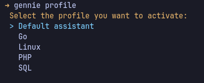
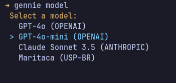

# Gennie: Your CLI Assistant

[](https://go.dev)
[](https://github.com/robertoseba/gennie/actions)
[](./LICENSE)

---

## 👋 Hi, I'm Gennie!

A powerful CLI assistant designed to support multiple models and profiles to suit your needs. Whether you're working on programming, researching movies, or diving into database management, I'm here to assist!

## 📁 Profiles



**Profiles act like personal assistants.** Create profiles for different topics and switch between them effortlessly. For example, have a profile for:

- **Database Administrator**: Optimized suggestions for database queries.
- **Film Buff**: Recommendations and insights on movies.
- **Unit Testing**: Guidance on writing reliable unit tests.

Use `gennie profile` to manage your profiles or the `--profile` flag with the `ask` command.

**Profiles are cached for performance:**

- Set the environment variable `GINNIE_PROFILES_PATH` to customize your profile storage directory.
- Default location: `~/.config/gennie/profiles`
- Refresh your cached profiles with `gennie profile refresh`.

## 🤖 Supported Models / AI Companies



**Explore multiple models at your fingertips!** Check and switch between them using `gennie model`, or with the `--model` flag in the `ask` command.

Current Models:

- [OpenAI's GPT-4](https://openai.com/)
- [OpenAI's GPT-4 Mini](https://openai.com/)
- [Anthropic's Claude](https://www.anthropic.com/)

### Coming Soon:

- [Maritaca AI](https://maritaca.ai/)
- [Groq's Llama](https://www.groq.com/)
- [Ollama](https://ollama.com/)

## Extra Features

### Follow-Up Questions

Enhance your queries with the `--followup` flag for related questions that build upon your previous interactions:

```bash
$ gennie ask "Create a list of the best movies of 2021"
$ gennie ask "Are there any movies in that list by Martin Scorcese?" --followup
```

> ⚠️ **Note**: Without a follow-up, your chat history is cleared. Use `--followup` to maintain context or export your history with the `export` command.

### Export Chat History

Effortlessly save your chat interactions using the `export` command:

```bash
$ gennie ask "Create a list of the best movies of 2021"
$ gennie export chat_history.txt
```

### Append Files to Questions

Incorporate context by appending files to your queries using the `--append` flag:

```bash
$ gennie ask "Build me a unit test for" --append main.go
```

### Check Status

Keep track of your current model and profile with:

```bash
$ gennie status
```

## 🚀 Installation

### Using Go:

```bash
$ go install github.com/robertoseba/gennie@latest
```

### Downloading the Binary:

Visit the [releases page](https://github.com/robertoseba/gennie/releases) to download the appropriate binary for your system.

## 📖 Usage

```
$ gennie -h

Gennie is a cli assistant with multiple models and profile support.

Usage:
  gennie [command]

Available Commands:
  ask         You can ask anything here
  clear       Clears all the conversation and preferences from cache
  completion  Generate the autocompletion script for the specified shell
  export      Export the chat history to a file
  help        Help about any command
  model       Configures which model to use.
  profile     Profile management
  status      Shows the current status of gennie

Flags:
  -h, --help   help for gennie

Use "gennie [command] --help" for more information about a command.
```

## 🐛 Issues and Suggestions

Gennie is an **OPEN** source project in its early stages. We welcome any bugs, issues, or suggestions you may have. Feel free to create an issue or contact me directly, and I'll respond as soon as possible!

## 📄 License

This project is licensed under the [MIT License](./LICENSE).
